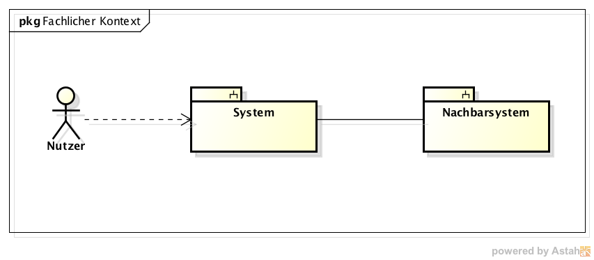
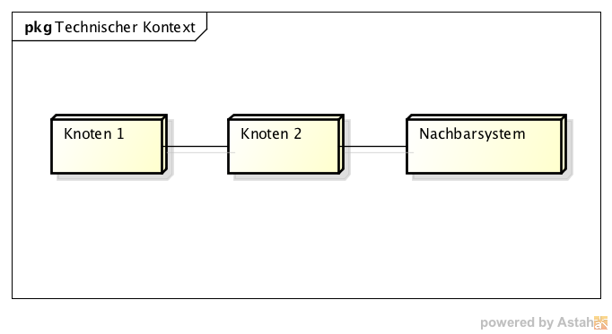

# Kontextabgrenzung
**Inhalt.**

Die Kontextsicht grenzt das System, für das Sie die Architektur entwickeln, von allen Nachbarsystemen ab. Sie legt damit die wesentlichen externen Schnittstellen fest. Stellen Sie sicher, dass die Schnittstellen mit allen relevanten Aspekten (was wird übertragen, in welchem Format wird übertragen, welches Medium wird verwendet, ...) spezifiziert wird, auch wenn einige populäre Diagramme (wie z.B. das UML Use-Case Diagramm) nur ausgewählte Aspekte der Schnittstelle darstellen.

**Motivation.**

Die Schnittstellen zu Nachbarsystemen gehören zu den kritischsten Aspekten eines Projektes. Stellen Sie rechtzeitig sicher, dass Sie diese komplett verstanden haben.
- Diverse Kontextdiagramme (siehe folgende Abschnitte)
- Listen von Nachbarsystemen mit deren Schnittstellen.

Die folgenden Unterkapitel zeigen die Einbettung unseres Systems in seine Umgebung.

## Fachlicher Kontext
**Inhalt.**

Festlegung aller [^1] Nachbarsysteme des betrachteten Systems mit Spezifikation aller fachlichen Daten, die mit diesen ausgetauscht werden. Zusätzlich evtl. Datenformate und Protokolle der Kommunikation mit Nachbarsystemen und der Umwelt (falls diese nicht erst bei den spezifischen Bausteinen präzisiert wird.

**Motivation.**

Verstehen, welche (logischen) Informationen mit Nachbarsystemen (in welcher Form) ausgetauscht werden.

**Form.**

Logisches Kontextdiagramm, in der UML z.B. simuliert durch Klassendiagramme, Use Case Diagramme, Kommunikationsdiagramme - kurz durch alle Diagramme, die das System als Black Box darstellen und die Schnittstellen zu den Nachbarsystemen (mehr oder weniger ausführlich) beschreiben.

Alternativ oder ergänzend können Sie einfach eine Tabelle verwenden. Der Titel gibt den Namen Ihres Systems wieder; die drei Spalten sind: Nachbarsystem, Input, Output. Auch so kommen Sie zu einer kompletten Schnittstellenbeschreibung.

 [Quelle](https://github.com/falkoschumann/template-arc42)

## Technischer- oder Verteilungskontext
**Inhalt.**

Festlegung der Kanäle zwischen Ihrem System, den Nachbarsystemen und der Umwelt; Zusätzlich eine Mapping-Tabelle, welcher logische Input (aus 3.1) über welchen Kanal ein- oder ausgegeben wird.

**Motivation.**

Verstehen, über welche Medien Informationen mit Nachbarsystemen bzw. der Umwelt ausgetauscht werden.

**Form.**

z.B.: UML Deployment-Diagramm mit den Kanälen zu Nachbarsystemen, begleitet von einer Mapping-Tabelle Kanal x Input/Output.

 [Quelle](https://github.com/falkoschumann/template-arc42)

## Externe Schnittstellen
**Inhalt.**

Spezifikation der Kommunikationskanäle, die ihr System mit den Nachbar-Systemen und der Umwelt verbinden.

**Externe Schnittstelle 1**

Name / Bezeichnung der Schnittstelle     | Name der Schnittstelle
---------------------------------------- | ----------------------
Version                                  |
Änderungen gegenüber Vorversion          |
Wer hat geändert und warum?              |
Verantwortlicher Ansprechpartner / Rolle |

**Fachliche Abläufe.**

**_Diagramm oder Beschreibung der fachlichen Abläufe_**
- **_Beschreibung der fachlichen Bedeutung_**
- Technischer Kontext
- Form der Interaktion
- Laufzeit
- Durchsatz / Datenvolumen
- Verfügbarkeit
- Protokollierung
- Archivierung
- Datenformate
- Gültigkeits- und Plausibilitätsregeln
- Codierung, Zeichensätze
- Konfigurationsdaten
- Prüfdaten
- fachliche oder technischer Ablauf
- Nebenwirkungen, Konsequenzen
- Technische Protokolle
- Welche Fehler werden erkannt?
- Wie werden sie intern behandelt?
- Welche Fehler werden nach aussen gegeben?
- Berechtigungen
- Zeitliche Einschränkungen
- Parallele Benutzung
- Voraussetzungen zur Nutzung
- Verantwortliche
- Kosten der Nutzung
- Organisatorisches
- Versionierung
- Beispieldaten
- Beispielabläufe / -interaktionen
- Programmierbeispiele

[^1]: alle,Zwar sind wir an vielen Stellen zu Pragmatismus bereit – hier     jedoch bestehen wir auf der vollständigen Auflistung aller     **(a-l-l-e-r)** Nachbarsysteme. Zu viele Projekte sind daran     gescheitert, dass sie ihre Nachbarn nicht kannten :-(
