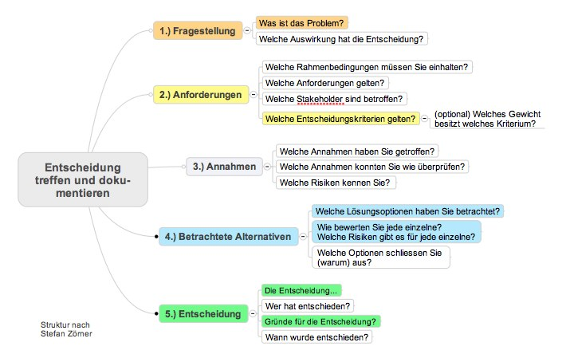

# Entwurfsentscheidungen
**Inhalt.**

Dokumentieren Sie hier alle wesentlichen Entwurfsentscheidungen und deren Gründe!

**Motivation.**

Es ist wünschenswert, alle wichtigen Entwurfsentscheidungen geschlossen nachlesen zu können. Wägen Sie ab, inwiefern Entwurfsentscheidungen hier zentral dokumentiert werden sollen oder wo eine lokale Beschreibung (z.B. in der Whitebox-Sicht von Bausteinen) sinnvoller ist. Vermeiden Sie aber redundante Texte. Verweisen Sie evtl. auf Kap. 4 zurück, wo schon zentrale Architekturstrategien motiviert wurden.

**Form.**

informelle Liste, möglichst nach Wichtigkeit und Tragweite der Entscheidungen für den Leser aufgebaut.

Alternativ auch ausführlicher in Form von einzelnen Unterkapiteln je Entscheidung. Die folgende Mindmap (Quelle: Kolumne „Architekturen dokumentieren" von S. Zörner im Java Magazin 3/2009) soll Sie dabei unterstützen, wichtige Entscheidungen zu treffen und festzuhalten. Die Hauptäste stellen dabei die wesentlichen Schritte dar. Sie können auch als Überschriften innerhalb eines Unterkapitels dienen (siehe Beispiel unten).

Die Fragen sind nicht sklavisch der Reihe nach zu beantworten. Sie sollen Sie lediglich leiten. In der Vorlage löschen Sie diese heraus, und lassen nur die Inhalte/Antworten stehen.

## Entwurfsentscheidung 1
### Fragestellung
Was genau ist das Problem?

Warum ist es für die Architektur relevant?

Welche Auswirkung hat die Entscheidung?

### Rahmenbedingungen
Welche festen Randbedingungen haben Sie einzuhalten?

Welche Einflussfaktoren sind zu beachten?

### Annahmen
Welche Annahmen haben Sie getroffen?

Welche Annahmen können wie vorab überprüft werden?

Mit welchen Risiken müssen Sie rechnen?

### Entscheidungskriterien
Nach welchen Kriterien treffen Sie (oder die jeweiligen Entscheider) diese Entscheidung? Denken Sie an technische, organisatorische, juristische oder kommerzielle Kriterien, befragen Sie dazu die relevanten ?

### Betrachtete Alternativen
Welche Lösungsoptionen ziehen Sie in die nähere Auswahl?

Wie bewerten Sie jede einzelne?

Welche Optionen schließen Sie bewusst aus?

### Entscheidung
Wer (wenn nicht Sie selbst) hat die Entscheidung getroffen?

Wie ist sie begründet?

Wann wurde entschieden?

...

## Entwurfsentscheidung n
