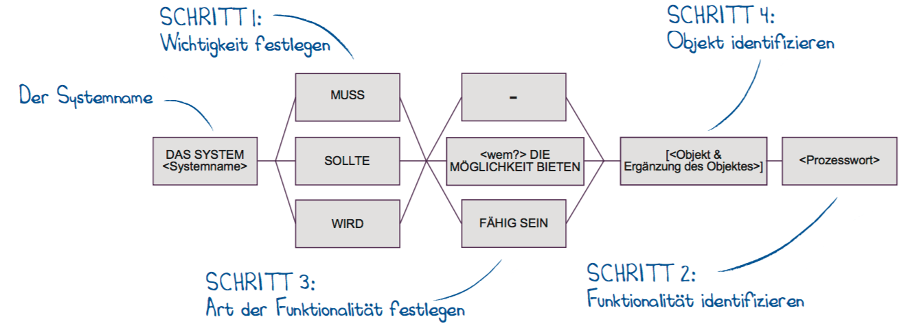

<a name="Anforderungen">
# Anforderungen
</a>
`dal:` **Hinzugefügtes Kapitel.**
Auch wenn das Dokument nicht zum Erfassen aller Anforderungen gedacht ist,
kann es helfen (ähnlich wie in dem Kapitel [1](#Einfuehrung)), die
**wichtigsten Anforderungen** zu dokumentieren. Dies kann bei schwierig zu strukturierenden Anforderungen durchaus in einem eigenen Kapitel erfolgen.
Es bietet sich dann an auf Kapitel [3](#Randbedingungen) zu verzichten.

## Anwendungsfälle

Das vorliegende Kapitel dient der Darstellung und Beschreibung wesentlicher
Anwendungsfälle der Systembausteine.

Zugunsten der Lesbarkeit dieses Dokumentes beschränkt sich dieses Kapitel auf die erste
Ebene der Anwendungsfälle. Eine angefertigte Verfeinerung und ausführlichere
Beschreibung ist der [Anlage](#Anlage) X Anwendungsfälle zu entnehmen. Die dort angeführten
Anwendungsfälle dienen als Grundlage zum Ableiten funktionaler Anforderungen in dem nachfolgendem Kapitel.

Die Dokumentation erfolgt zunächst anhand einer grafischen Beschreibung der
Anwendungsfälle unter Verwendung der UML als Notation. Darüber hinaus erfolgt eine
textuelle (Kurz-)Beschreibung in tabellarischer Form.

`Hinweis:` Bei der Priorität gibt es die Werte: hoch, mittel und gering. Die Vergabe wurde
aus der festgestellten Notwendigkeit der Umsetzung der betrachteten Anforderung
für die Erreichung der Projektziele abgeleitet.

### Baustein 1

| Nummer Name |
|---|---|
| **Ziel** | |
| **Akteur** | |
| **Priorität** | {Hoch/Mittel/Gering} |
| **Anmerkungen** |  |
| **Offene Punkte** |  |
| **Wird verfeinert um** | ...|
| ... |  Nummer - Name |
| ... |  Nummer - Name |
| ... |  Nummer - Name |

## Funktionale Anforderungen

Auf Basis der vorgestellten und im Anhang befindlichen Anwendungsfälle erfolgt die
Erfassung der funktionalen Anforderungen. Aufgrund des iterativen Vorgehens im Rahmen
dieses Projektes erfolgt eine Priorisierung der zentralen, zum Erreichen der wesentlichen
Projektziele notwendigen, Anforderungen. Die erste Iteration zeichnet sich weiterhin durch
das Bestreben aus `....`
Hierzu notwendige Anforderungen sämtlicher Komponenten wurden somit als Hoch eingestuft.

`Kurz darlegen, nach welchem Schema Anforderungen dokumentiert werden`
***z.B:***

Die Aufschlüsselung der Anforderungen erfolgt für jeden Systembaustein separat. Die Beschreibungen werden nach der erprobten Bausteinschablone von Chris Rupp gebildet.

([Quelle. ](http://www4.in.tum.de/lehre/vorlesungen/re/ws12/uebung/REuM5AuflKap7.pdf))

### Baustein 1

| Nummer | Name | Prio. | Beschreibung |
|---|---|---|---|
| ... | ... | ... | ... |
| FA10 | <> speichern | Hoch | Das UI sollte dem Anwender die Möglichkeit bieten <> zu speichern |
| FA11 | <> laden | Hoch | Das UI sollte dem Anwender die Möglichkeit bieten <> zu laden |
| ... | ... | ... | ... |

#### Offene Punkte

## Nicht-funktionale Anforderungen

Nicht-funktionale Anforderungen stellen spezielle Rahmenanforderungen dar, die die
Architektur des zu erstellenden Systems beeinflussen. In diesem ersten Entwurf werden die
wesentlichen nicht-funktionalen Anforderungen benannt. Hierbei wird differenziert zwischen
technischen, rechtlichen und organisatorischen Rahmenanforderungen sowie den
Qualitätsanforderungen.
Quantifizierbare Qualitätsszenarien zur Überprüfung der Einhaltung definierter nicht-
funktionaler Anforderungen sollen in einer der folgenden Iterationen erstellt werden.

### Technische Rahmenanforderungen

| Hardware-Vorgaben|
|---|---|
| **Name** | **Beschreibung** |
| ... | ... |

| Software-Vorgaben|
|---|---|
| **Name** | **Beschreibung** |
| ... | ... |

### Rechtliche Rahmenanforderungen

### Orginsatorische Rahmenanforderungen

### Qualitätsanforderungen

## Konventionen
