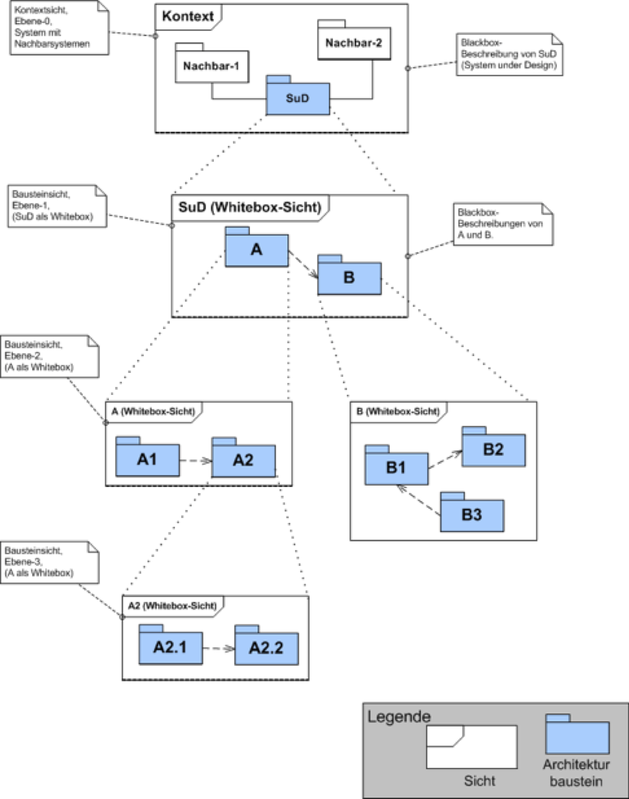

# Bausteinsicht
**Inhalt** Statische Zerlegung des Systems in Bausteine (Module, Komponenten, Subsysteme, Teilsysteme, Klassen, Interfaces, Pakete, Bibliotheken, Frameworks, Schichten, Partitionen, Tiers, Funktionen, Makros, Operationen, Datenstrukturen...) sowie deren Beziehungen.

**Motivation** Dies ist die _wichtigste Sicht_, die in jeder Architekturdokumentation vorhanden sein muss. Wenn Sie es mit dem Hausbau vergleichen ist das der Grundrissplan.

**Form** Die Bausteinsicht ist eine hierarchische Sammlung von BlackBox- und White-Box- Beschreibungen (siehe Abbildung unten):

Ebene 1 ist die White-Box-Beschreibung des Gesamtsystems (System under Development / SUD) mit den Black- Box- Beschreibungen der Bausteine des Gesamtsystems Ebene 2 zoomt dann in die Bausteine der Ebene 1 hinein und ist somit die Sammlung aller White-Box- Beschreibungen der Bausteine der Ebene 1 zusammen mit den Black-Box-Beschreibungen der Bausteine der Ebene 2. Ebene 3 zoomt in die alle Bausteine der Ebene 2 hinein, u.s.w.

_Whitebox-Template:_ Enthält mehrere Bausteine, zu denen Sie jeweils eine Black-Box Beschreibung erstellen.

_Blackbox-Template_ Für jeden Baustein aus dem White-Box-Template sollten Sie folgende Angaben machen: (Kopieren Sie diese Punkte in die folgenden Unterkapitel)
- Zweck / Verantwortlichkeit:
- Schnittstelle(n):
- Erfüllte Anforderungen:
- Ablageort / Datei:
- Sonstige Verwaltungsinformation: Autor, Version, Datum, Änderungshistorie

## Ebene 1
An dieser Stelle beschreiben Sie die White-Box-Sicht der Ebene 1 gemäß dem Whitebox-Template. Die Struktur ist im folgenden bereits vorgegeben. Das Überblicksbild zeigt das Innenleben des Gesamtsystems in Form der Bausteine 1 - n, sowie deren Zusammenhänge und Abhängigkeiten. Sinnvoll sind hier auch Beschreibungen der wichtige Begründungen, die zu dieser Struktur führen, insbesondere die Beschreibung der Abhängigkeiten (Beziehungen) zwischen den Bausteinen dieser Ebene. Evtl. verweisen Sie auch auf verworfene Alternativen (mit der Begründung, warum es verworfen wurde Die folgende Abbildung zeigt die Hauptbausteine unseres Systems und deren Abhängigkeiten.

`hier Überblicksdiagramm einfügen`

Erläuterung zu Struktur und Abhängigkeiten der Ebene 1:

### Bausteinname 1 (BlackBox-Beschreibung
Struktur gemäß Black-Box- Template:
- Zweck / Verantwortlichkeit:
- Schnittstelle(n):
- Erfüllte Anforderungen:
- Variabilität:
- Leistungsmerkmale:
- Ablageort / Datei:
- Sonstige Verwaltungsinformation:
- Offene Punkte:

### ...

### Offene Punkte

## Ebene 2

s.o
